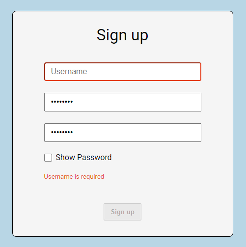
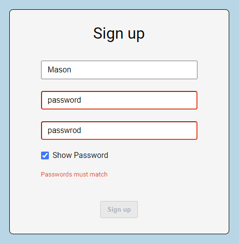
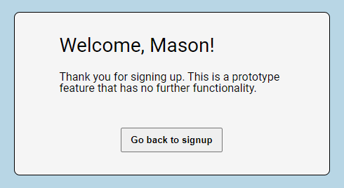

# Signup Form Prototype

[See the form live!](https://masonanders.github.io/signup-form-prototype/)

This is a prototype `Sign up` form built using React and JavaScript. This project was part of a coding challenge and is meant to showcase my abilities in using React and JavaScript as a Frontend Engineer.

## Form Requirements

The form must contain three inputs:

- Username
- Password
- Confirm Password

Each field must persist its own state as the form is filled out. All fields are required with no other restrictions on content. `Password` and `Confirm Password` must match in order to submit the form and the user should be alerted if they don't.

## User Experience Design

I wanted to ensure users are not met with any errors before they have made an attempt to correctly fill out the form. So the form starts in a non-error state until the user has clicked the `submit` button. Once submitted, all inputs are validated and if they are incorrect the form is then put into an error state which disables the `Sign up` button and highlights the invalid input fields and surfaces a message that provides details on the error(s) until they are corrected.

I also wanted to ensure users were able to view both password inputs to easily compare them should the two inputs not match. So I added a `Show Password` checkbox which toggles each `password` input to a `text` input, revealing the password(s) in plain text.

Finally, I wanted to add a welcome view once the user has successfully signed up to complete the experience. The username provided in the `Sign up` form is passed on to this view to add some personalization. However, since there is no further functionality intended for this project, I left a message saying as much as well as a button to return user to the `Sign up` form in its initial state.

## Implementation

I used the fairly standard way of initializing a React app, [`Create React App`](https://create-react-app.dev/) to set up my development environment. I removed a bunch of files that come with CRA initialization that were unnecessary for this scope of project and added a `reset.css` file (courtesy of [meyerweb.com](https://meyerweb.com/eric/tools/css/reset/)).

Since this project only consists of a single form and welcome view I opted not to use any routing and structured the root component, `App.js`, to render only the small box which acts as the container for the form and welcome view (I later added social links as a sibling to this box).

For the form inputs, I took the approach of using state tracked by React hooks over using the input DOM element API since I tend to find it more flexible and familiar. This makes it easy and concise to validate the fields using JavaScript within the React component.

Once the form is successfully submitted, I pass the `username` back to `App.ts` which stores the value within its own state and switches the `Sign up` form for the `Welcome` view, passing the `username` along to it. When the `Go back to sign up` button is clicked, it triggers `App.ts` to delete the stored `username`, which causes it to switch back to rendering the `Sign up` form component and the whole process is repeated.
